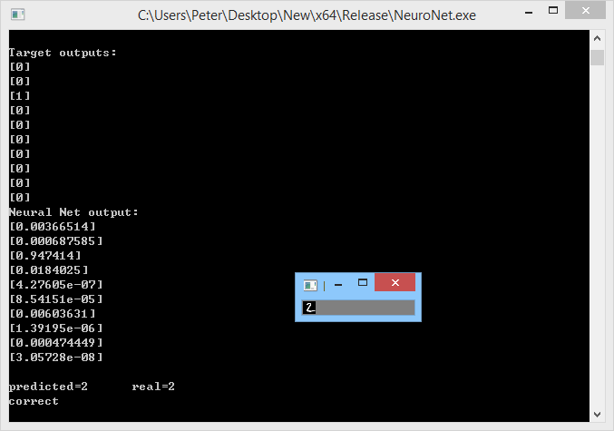
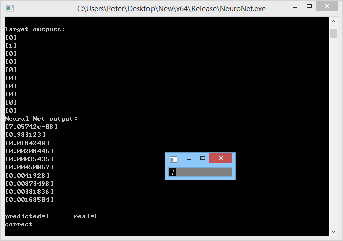
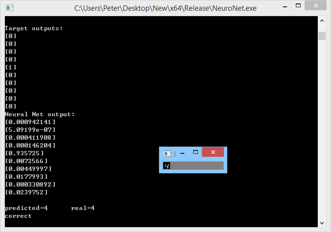
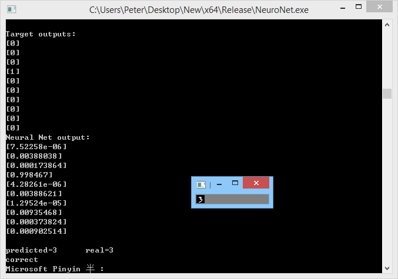

# NeuroNet 
## Introduction
This is a neural network course project, building a nerual network from scratch. Using only C++ standard library. The training algorithm is ``back-propagation``. Two examples are included in ``main.cpp``.
 - A 2-4-2 neural network, simulating the XOR gate.
 - The MNIST hand-written digit recognition.
Images visualizing the original MNIST data is using OpenCV. You can remove this feature to get pure standard c++ implementation.
### Note:
    For MNIST, I also implement a data reader to read the binary encoding into the neural networl. The original MNIST data is structured as 784 pixels per number. In our course project, we are asked to down-sampled to 196 pixels (4:1) to reduce processing time.
## MNIST
As mentioned in the ``Note``, the neural network structure used is 196-100-10. The MNIST testing is utilizing all the datas in the two files (One epoch => 60,000 training samples + 10,000 testing samples. Output of the neural net uses ``one-hot-encoding``. After 20 epochs, the accuracy gets to around 96%.
### Result
My machine run one epoch in less than 25 seconds. There are plenty of rooms to improve the performance, such as use ``std::valarray`` or even ``std::array`` instead of ``std::vector`` as the internal data for ``Matrix`` class. And using a specialization for vector instead of 1 element per ``std::vector`` (huge overhead) as a matrix. But it's good enough for learning purpose.
The specs of my machine:
- CPU: AMD Ryzen 7 1700
- RAM: 64GB DDR4 2400

## Compiling
This project is written in ``C++11``.
This is a ``Visual Studio 2019 solution``, if you have visual studio installed, simply open the .sln file and hit ctrl+F5 to run.
If you are on Windows, you can run the executable file in ./Release/NeuroNet.exe
~~If you are using another operating system, use g++ to compile. I only used standard C++ library, so no extra flags are needed.~~ The OpenCV binaries are **Windows Only**.

## Directory Structure:
    ./NeuroNet.sln          Visual studio solution file
    ./Release/              ...The executable file
    ./NeuroNet/             The source code
    ./Dependency/           OpenCV lib to display MNIST digits
